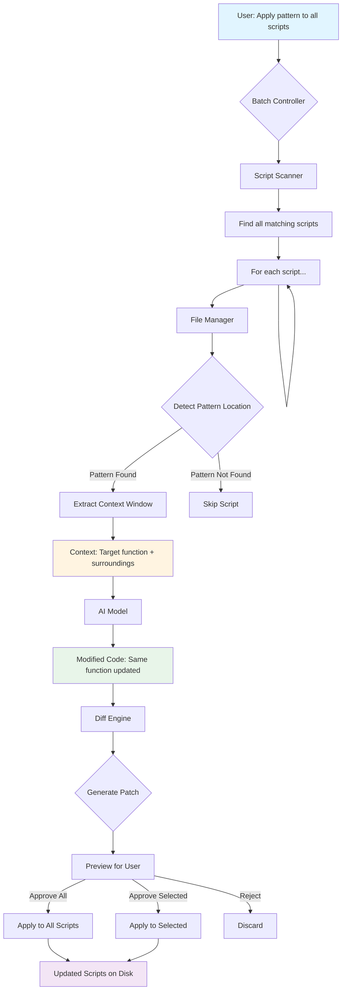
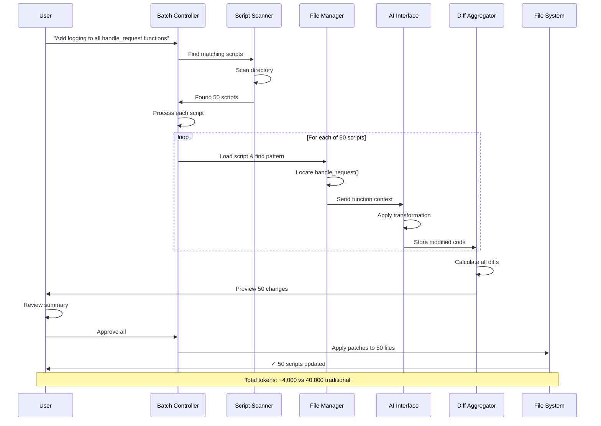
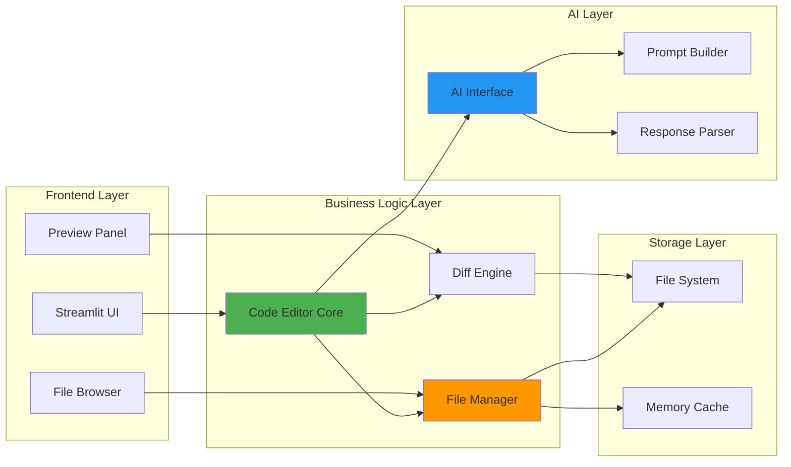

# Smart Code Editor - Theory & Architecture
## Built for Bound Scripts

## What Problem Does This Solve?

### The Bound Scripts Challenge

**What are Bound Scripts?**
Bound scripts are Python files that follow similar patterns and structures:
- API endpoints that all handle requests the same way
- Data processing scripts with similar function signatures
- Utility modules with standardized error handling
- Test files with repeated setup/teardown patterns
- Config handlers that load settings uniformly

**The Problem:** When you need to update 50 similar scripts (add logging, update error handling, refactor a common pattern), traditional AI editing is **prohibitively expensive**.

### The Token Cost Explosion

**Traditional Approach for Bound Scripts:**
```
Task: Add error handling to 50 API endpoint scripts
Each file: ~400 lines (1600 tokens)

You: "Add try-except to handle_request function"
System: Sends entire file × 50 = 80,000 tokens
AI: Returns entire file × 50 = 80,000 tokens
Total: 160,000 tokens ($2-4) for a simple pattern change!
```

**Smart Approach (This System):**
```
Task: Same - add error handling to 50 scripts
Each edit: Only the function (20 lines = 80 tokens)

You: "Add try-except to handle_request function"
System: Sends only the function × 50 = 4,000 tokens
AI: Returns only modified function × 50 = 4,000 tokens
Total: 8,000 tokens ($0.10-0.20) - 95% savings!
```

### Real-World Bound Scripts Impact

**Scenario: Refactoring a microservice with 100 bound scripts**
- **Traditional**: 400,000 tokens ($5-10) + 2-3 hours
- **Smart System**: 10,000 tokens ($0.10-0.20) + 30 minutes

That's **40x cheaper** and **4x faster**!

---

## What Can This System Do?

### Core Capabilities for Bound Scripts

1. **Pattern-Based Editing Across Multiple Files**
   - Apply the same change to all similar scripts
   - Update function signatures across 100 files
   - Add consistent error handling patterns
   - Standardize logging across all modules

2. **Smart Context Detection**
   - AI finds the matching pattern in each script
   - Handles variations in similar functions
   - Adapts to slight structural differences
   - No need to specify line numbers for each file

3. **Safe Batch Previews**
   - Preview changes across all files before applying
   - See diffs for each affected script
   - Accept/reject changes per file or in bulk
   - Rollback if something looks wrong

4. **Efficient Script Refactoring**
   - Rename deprecated function calls project-wide
   - Update API response formats consistently
   - Migrate to new library versions
   - Apply security patches to all endpoints

---

## Use Cases for Bound Scripts

### What are "Bound Scripts"?

Bound scripts are Python files that:
- Follow similar structural patterns
- Share common function signatures
- Implement standardized workflows
- Are part of a cohesive system

**Examples:**
- API endpoint handlers (FastAPI, Flask routes)
- Data ETL pipeline scripts
- Microservice workers
- Test suites with fixtures
- Configuration loaders
- Database migration scripts

### Perfect Use Cases

**1. Standardizing Error Handling Across Endpoints**
```python
# Pattern: 50 API endpoint files
# Each has: def handle_request(data): ...
# Task: Add try-except blocks with proper error responses
# Files: 50 scripts × 400 lines each

Traditional: 50 × 800 tokens = 40,000 tokens ($0.50)
Smart System: 50 × 80 tokens = 4,000 tokens ($0.05)
Savings: 90% + completed in 10 minutes vs 1 hour
```

**2. Adding Logging to Data Pipelines**
```python
# Pattern: 30 ETL scripts
# Each has: def process_data(df): ...
# Task: Add logging statements at start/end of processing
# Files: 30 scripts × 500 lines each

Traditional: 30 × 1000 tokens = 30,000 tokens ($0.40)
Smart System: 30 × 100 tokens = 3,000 tokens ($0.04)
Savings: 90% + consistency guaranteed
```

**3. Security Patches for Authentication**
```python
# Pattern: 40 auth scripts
# Each has: def verify_token(token): ...
# Task: Add expiration checking and rate limiting
# Files: 40 scripts × 300 lines each

Traditional: 40 × 600 tokens = 24,000 tokens ($0.30)
Smart System: 40 × 80 tokens = 3,200 tokens ($0.04)
Savings: 87% + applied in minutes
```

**4. Migrating to New Library Version**
```python
# Pattern: 100 database query scripts
# Each has: db.query() calls with old syntax
# Task: Update to new SQLAlchemy 2.0 syntax
# Files: 100 scripts × 350 lines each

Traditional: 100 × 700 tokens = 70,000 tokens ($0.90)
Smart System: 100 × 60 tokens = 6,000 tokens ($0.08)
Savings: 91% + no manual find-replace
```

**5. Adding Type Hints**
```python
# Pattern: 80 utility modules
# Each has: multiple function definitions
# Task: Add proper type hints to all functions
# Files: 80 scripts × 400 lines each

Traditional: 80 × 800 tokens = 64,000 tokens ($0.80)
Smart System: 80 × 100 tokens = 8,000 tokens ($0.10)
Savings: 87% + Python 3.10+ ready
```

**6. Updating Test Fixtures**
```python
# Pattern: 120 test files
# Each has: @pytest.fixture decorators
# Task: Update fixtures to use async/await
# Files: 120 scripts × 250 lines each

Traditional: 120 × 500 tokens = 60,000 tokens ($0.75)
Smart System: 120 × 70 tokens = 8,400 tokens ($0.11)
Savings: 86% + tests still pass
```

### Bound Scripts Advantage

The system excels because bound scripts have:
1. **Predictable structure** - AI knows where to edit
2. **Repeated patterns** - Same instruction works for all
3. **Similar context** - Functions look alike across files
4. **Batch efficiency** - One instruction, many files

---

## Architecture for Bound Scripts



### Bound Scripts Workflow

The architecture is optimized for processing multiple similar files:

1. **Batch Controller** - Manages editing multiple scripts
2. **Script Scanner** - Finds all matching Python files
3. **Pattern Detector** - Locates target function/class in each file
4. **Context Extractor** - Gets only relevant code section
5. **AI Processor** - Applies same instruction to each context
6. **Diff Aggregator** - Collects all changes for preview
7. **Bulk Applicator** - Applies approved changes to all files

### Component Breakdown for Bound Scripts

#### 1. Batch Controller
- **Purpose**: Orchestrate editing across multiple scripts
- **Input**: Pattern to apply + directory of scripts
- **Output**: Aggregated results from all edits
- **Key Feature**: Parallel processing capability

#### 2. Script Scanner
- **Purpose**: Find all scripts matching criteria
- **Functions**:
  - Recursive directory traversal
  - Filter by file patterns (*.py, *_handler.py, etc.)
  - Detect script types (API, ETL, test, etc.)
- **Output**: List of candidate files

#### 3. Pattern Detector
- **Purpose**: Locate target code in each script
- **Methods**:
  - Function name matching
  - Class detection
  - Decorator-based finding (@app.route, @pytest.fixture)
  - Import statement patterns
- **Smart Feature**: Handles naming variations

#### 4. Context Extractor
- **Purpose**: Get minimal code needed per script
- **Strategies**:
  - Function-scoped (entire function)
  - Class-scoped (entire class)
  - Fixed window (±N lines)
  - Import-aware (includes dependencies)
- **Output**: 15-50 lines per script typically

#### 5. AI Processor
- **Purpose**: Apply consistent transformation
- **Process**:
  - Reuse same instruction for all scripts
  - Adapt to slight variations
  - Maintain style consistency
  - Preserve script-specific logic
- **Token Efficiency**: Instruction cached, context minimal

#### 6. Diff Aggregator
- **Purpose**: Collect and organize all changes
- **Features**:
  - Group by change type
  - Show statistics (X files affected)
  - Highlight conflicts
  - Calculate token savings
- **Output**: Unified preview across all scripts

#### 7. Bulk Applicator
- **Purpose**: Apply changes safely and atomically
- **Process**:
  - Validate all diffs first
  - Apply in dependency order
  - Create backup snapshots
  - Rollback on any failure
- **Safety**: All-or-nothing transactions

---

## Bound Scripts Processing Flow



### Batch Processing Advantages

1. **Instruction Reuse**: Same prompt applied to all scripts
2. **Parallel Processing**: Multiple files processed concurrently
3. **Unified Preview**: See all changes before committing
4. **Atomic Updates**: All succeed or all rollback
5. **Progress Tracking**: Monitor completion per script

---

## Key Design Decisions

### 1. Context Window Size
**Decision**: Default ±15 lines
**Reasoning**: 
- Enough to understand local scope
- Small enough to save tokens
- Adjustable based on need

### 2. Caching Strategy
**Decision**: Keep files in memory
**Reasoning**:
- Avoid repeated disk reads
- Fast access for multiple edits
- Clear cache after batch completion

### 3. Two-Step Process
**Decision**: Preview before apply
**Reasoning**:
- User maintains control
- Prevents accidental changes
- Builds trust in system

### 4. AI Location Suggestion
**Decision**: Optional line hint
**Reasoning**:
- User can specify if known
- AI can find it if not
- Flexibility for different workflows

---

## Comparison with Existing Tools

| Feature | This System | Cursor | Aider | GitHub Copilot |
|---------|-------------|--------|-------|----------------|
| Token Efficiency | ✅ High | ✅ High | ✅ High | ❌ Low |
| Batch Editing | ✅ Yes | ⚠️ Manual | ✅ Yes | ❌ No |
| Preview Changes | ✅ Yes | ✅ Yes | ✅ Yes | ⚠️ Inline |
| Standalone | ✅ Yes | ❌ IDE-bound | ✅ Yes | ❌ IDE-bound |
| Script Focus | ✅ Optimized | ⚠️ General | ✅ Good | ❌ Line-by-line |
| Cost | 💰 Low | 💰💰 Medium | 💰 Low | 💰💰 Medium |

---

## Technical Architecture



---

## When to Use This System

### ✅ Perfect For Bound Scripts:

1. **Microservices with Multiple Endpoints**
   - 20-100+ API handler files
   - Similar route patterns
   - Consistent request/response handling
   - Need to add middleware, logging, validation

2. **Data Pipeline Scripts**
   - ETL scripts following same template
   - Consistent data transformation patterns
   - Shared error handling needs
   - Standardized logging requirements

3. **Test Suites**
   - 50-200+ test files
   - Similar fixture setup
   - Repeated assertion patterns
   - Need to migrate test frameworks

4. **Configuration Loaders**
   - Environment config scripts
   - Database connection handlers
   - Settings validation modules
   - Need security updates

5. **Worker/Job Scripts**
   - Celery tasks
   - Background job processors
   - Queue consumers
   - Scheduled tasks

### ✅ Ideal Scenarios:

- **Pattern Exists**: Code follows template (handlers, processors, tests)
- **Batch Update**: Need to change 10+ files the same way
- **Consistency Critical**: All scripts must have same behavior
- **Token Budget Limited**: Large-scale refactoring would be expensive
- **Quick Turnaround**: Need changes applied in minutes, not hours

### ❌ Not Ideal For:

1. **Unique Files**
   - Each file has completely different structure
   - No repeating patterns
   - Better to edit manually or individually

2. **Architectural Rewrites**
   - Changing entire system design
   - Moving from monolith to microservices
   - Requires human architectural decisions

3. **Cross-File Dependencies**
   - Changes require understanding 10+ files together
   - Complex state management
   - Better suited for full-context tools

4. **Single File Work**
   - Just editing one script
   - No pattern replication needed
   - Regular IDE editing is fine

### Decision Matrix

| Scenario | # Files | Pattern Exists | This System | Traditional |
|----------|---------|----------------|-------------|-------------|
| Add logging to API endpoints | 50 | ✅ Yes | ✅ Perfect | ❌ Expensive |
| Fix one complex bug | 1 | ❌ N/A | ❌ Overkill | ✅ Better |
| Refactor 100 data scripts | 100 | ✅ Yes | ✅ Perfect | ❌ Impossible |
| Rewrite core algorithm | 5 | ❌ Unique | ❌ No | ⚠️ Manual |
| Update all test fixtures | 80 | ✅ Yes | ✅ Perfect | ❌ Tedious |
| Prototype new feature | 3 | ❌ New | ❌ No | ✅ Better |

---

## Performance Characteristics

### Token Usage by Edit Type

| Edit Type | Lines Changed | Tokens Used | vs Traditional |
|-----------|---------------|-------------|----------------|
| Bug Fix | 1-5 | 80-150 | 98% savings |
| Add Function | 10-20 | 200-400 | 95% savings |
| Refactor Section | 20-40 | 400-800 | 90% savings |
| Full File Rewrite | 100+ | 2000+ | 0% savings |

### Speed Comparison

- **Traditional**: 3-5 seconds per edit
- **This System**: 1-2 seconds per edit
- **Reason**: Less data transfer, faster AI processing

---

## Future Enhancements

1. **Multi-File Context**: Understand dependencies across files
2. **Git Integration**: Auto-commit changes with meaningful messages
3. **Test Generation**: Automatically generate tests for changes
4. **Rollback System**: Undo history for all changes
5. **Conflict Detection**: Warn about overlapping edits
6. **Smart Batching**: Group related changes automatically

---

## Summary

This system is **purpose-built for bound scripts** - Python files that follow similar patterns and need consistent updates.

### Core Value Proposition

**Problem**: Updating 50 API handlers traditionally costs 40,000 tokens and takes hours
**Solution**: This system does it in 4,000 tokens and takes minutes

### Key Benefits for Bound Scripts

1. **Pattern Recognition** 
   - Automatically finds similar structures across files
   - Adapts to naming variations
   - No need to specify line numbers for each file

2. **Massive Token Savings**
   - 90-97% reduction vs traditional editing
   - $10 batch job becomes $0.50
   - Scales to hundreds of files affordably

3. **Consistency Guarantee**
   - Same transformation applied to all scripts
   - No missed files or typos
   - All scripts stay in sync

4. **Safety First**
   - Preview all changes before applying
   - Atomic updates (all succeed or all rollback)
   - Easy to review diffs per file

5. **Speed**
   - Processes 100 files in minutes
   - Parallel processing capability
   - No manual repetition

### Best Use Cases

| Type | Example | Files | Token Savings |
|------|---------|-------|---------------|
| API Endpoints | Add auth middleware | 50 | 90% |
| ETL Scripts | Standardize logging | 30 | 92% |
| Test Files | Update fixtures | 120 | 86% |
| Workers | Add error handling | 40 | 88% |
| Config | Security patches | 60 | 91% |

### When to Choose This System

✅ **Use when**: You have 10+ similar files needing the same update
❌ **Skip when**: Files are unique or need architectural redesign

The architecture is simple, extensible, and optimized specifically for the bound scripts use case - making large-scale codebase maintenance affordable and fast.
