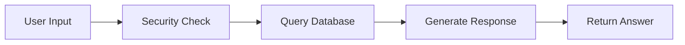
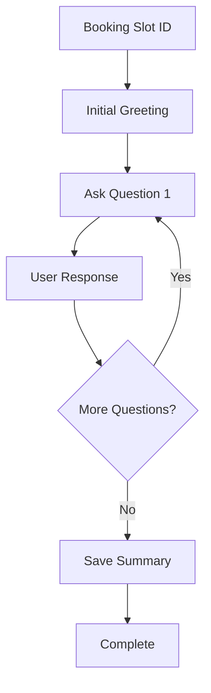
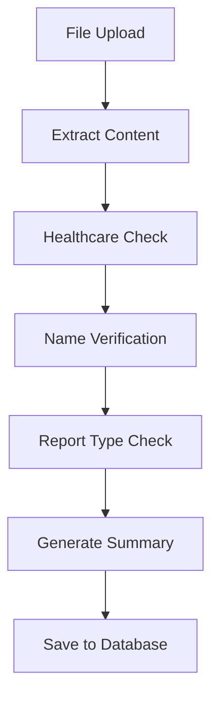
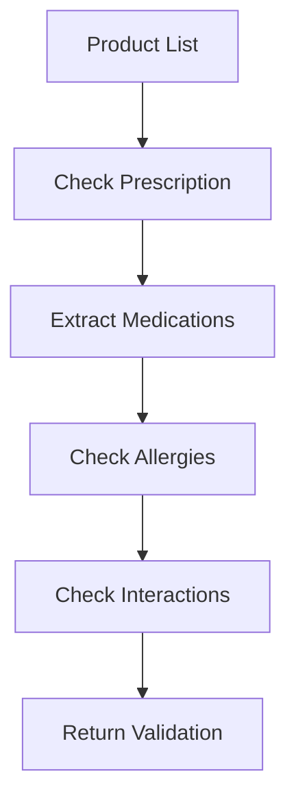
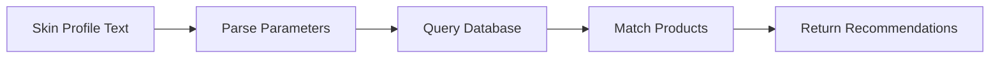
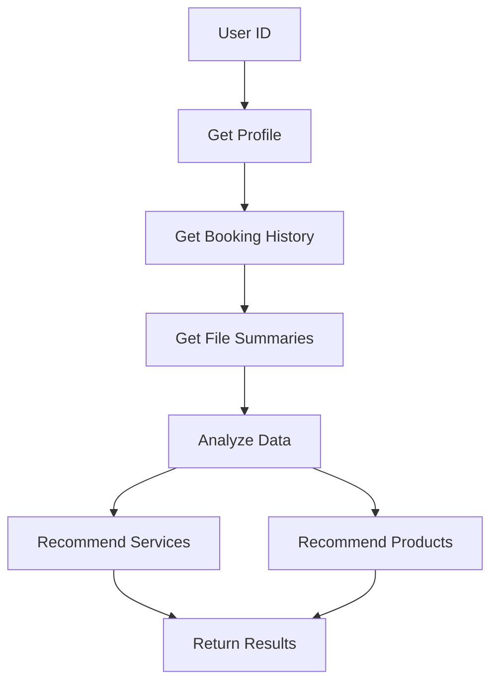
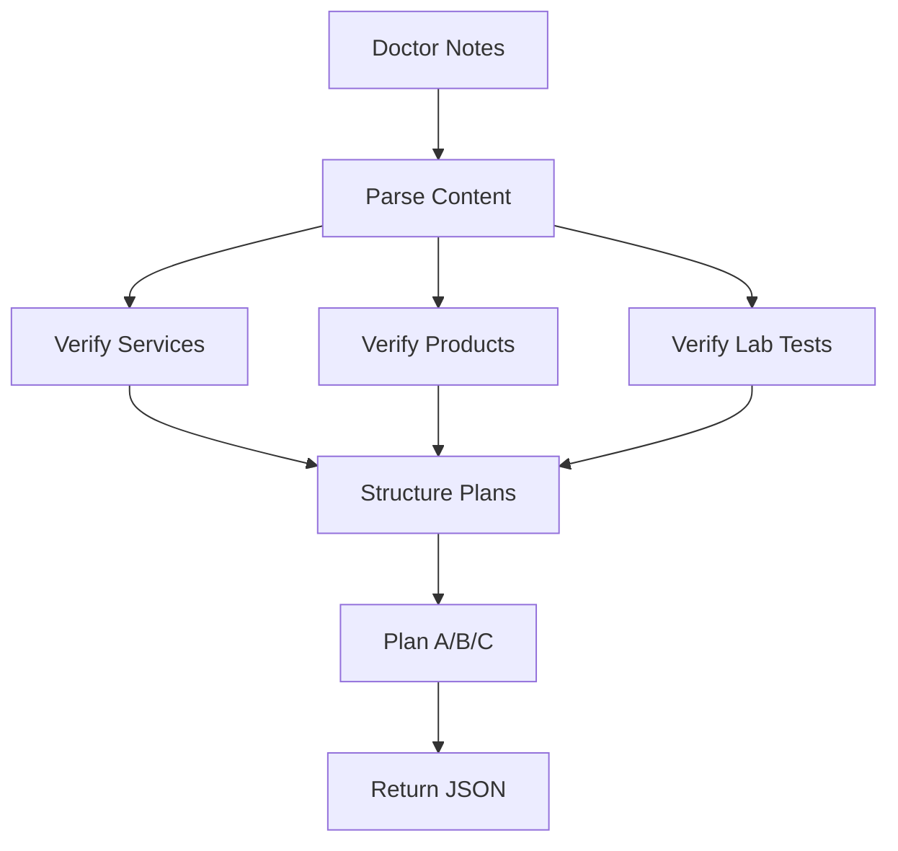
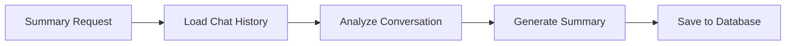
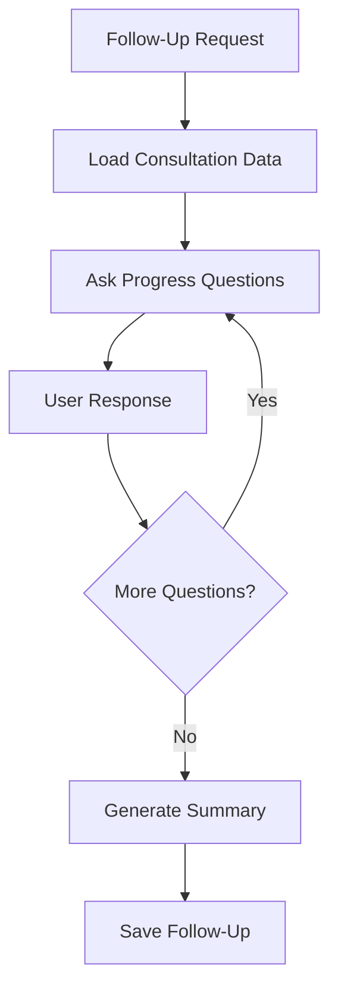

# Aesthetics AI Service - Use Cases Overview

This document provides a high-level overview of all working use cases in the Aesthetics AI orchestration service.

---

## 1. General Chat Query (Ask)

**Purpose:** Handle user questions about services, treatments, doctors, and healthcare information through conversational chat.

**Key Features:**
- Users can ask any healthcare-related question through text input
- System searches database for services, doctors, pricing, and treatment information
- Provides personalized responses with recommendations and next steps
- Maintains conversation context throughout the session

**Flow:**

---

## 2. Pre-Consultation Assessment (Booking Chat)

**Purpose:** Conduct automated pre-consultation assessment for booked appointments by asking structured questions to gather patient information.

**Key Features:**
- Asks 5-10 questions (mix of MCQ, text, and image upload requests)
- Gathers patient concerns, medical history, expectations, and visual assessments
- Automatically saves assessment summary to database for doctor review
- Supports three question types: multiple choice, open-ended text, and file upload

**Flow:**

---

## 3. File Processing & Validation

**Purpose:** Process uploaded medical documents (PDFs, images) and extract healthcare information with automatic validations. When prescription files are uploaded, automatically validates products and checks for allergy conflicts.

### 3.1 File Processing & Summary

**Key Features:**
- Extracts text from PDFs and analyzes images using AI
- Uses OCR (Optical Character Recognition) for scanned PDFs when text extraction fails
- Automatically checks if file is healthcare-related
- Validates patient name matches database records
- Validates if uploaded file matches requested report type (e.g., "blood report", "CT scan")
- Generates comprehensive summaries with all medical parameters

**Flow:**

### 3.2 Prescription Validation with Allergy Checking

**Key Features:**
- Automatically triggered when prescription files are uploaded
- Checks if products require prescription (rx_required flag)
- Searches prescription text for product names
- Determines if user can take the product based on prescription presence
- Automatically analyzes prescription for allergy conflicts with patient's known allergies
- Detects medication interactions with current medications

**Flow:**

---

## 4. Personalized Recommendations

**Purpose:** Recommend services and products based on patient data. When skin profile values are provided, returns skin-specific product recommendations. Otherwise, provides general personalized recommendations based on profile, history, and documents.

### 4.1 Skin Product Recommendations

**Key Features:**
- Triggered when skin profile values (skinValues) are provided
- Accepts freeform text describing skin concerns, constraints, and AI-generated scores
- Queries skin_profiles database to find matching product recommendations
- Returns personalized product suggestions with usage instructions
- Matches based on skin type, acne severity, pore score, pigmentation, hydration, and other factors

**Flow:**

### 4.2 General Service & Product Recommendations

**Key Features:**
- Triggered when recommendations flag is set without skinValues
- Analyzes patient demographics (gender, age) to filter appropriate services
- Reviews past bookings and consultation summaries
- Considers uploaded medical reports and treatment history
- Recommends complementary services and maintenance treatments
- Suggests products that support past treatments and address medical conditions

**Flow:**

---

## 5. Treatment Planner (Plan A/B/C)

**Purpose:** Convert doctor's treatment notes into structured treatment plans (Plan A, B, C) with complete database verification.

**Key Features:**
- Parses doctor's notes to extract services, products, and lab tests
- Verifies all items against database (services, products, lab tests)
- Structures into three plans: Plan A (primary treatment), Plan B (alternative), Plan C (medications/products)
- Includes complete cost information and service specifications
- Returns verified IDs for all services, products, and lab tests

**Flow:**

---

## 6. Chat Summary Generation

**Purpose:** Generate comprehensive summary of complete chat session for long-term memory storage.

**Key Features:**
- Automatically detects summary requests through keywords (e.g., "make a summary", "summarize chat")
- Reviews complete conversation history from the session
- Creates structured summary with title, topics discussed, key information, and next steps
- Stores summary in database for future context retrieval
- Enables long-term memory across multiple sessions

**Flow:**

---

## 7. Follow-Up Chat (Post-Consultation)

**Purpose:** Conduct interactive follow-up assessment after consultation to track patient progress and recovery.

**Key Features:**
- Asks follow-up questions about treatment progress and recovery
- References previous consultation details and treatment plan
- Gathers information about side effects, results, and patient satisfaction
- Tracks progress over time with follow-up dates
- Generates follow-up summary for doctor review

**Flow:**

---

*Document Version: 1.0 | Last Updated: December 2025*

