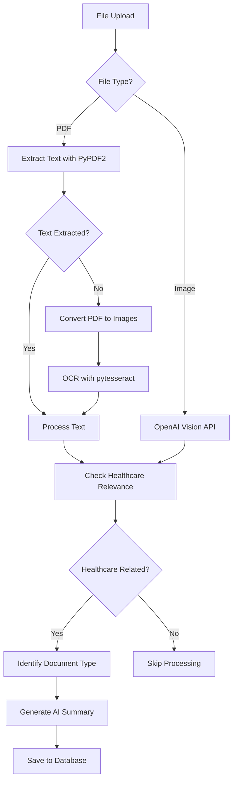

# File Processing Workflow

## Overview

The system processes three types of files: Regular PDFs, Scanned PDFs (images), and Image files. Each type uses different extraction methods to analyze healthcare-related content.

---

## Processing Flow Diagram



---

## Type 1: Regular PDF Processing

**Method:** Text extraction using PyPDF2

**Code Snippet:**
```python
def process_pdf_file(file_data: bytes):
    pdf_reader = PyPDF2.PdfReader(io.BytesIO(file_data))
    text_content = ""
    
    for page in pdf_reader.pages:
        text_content += page.extract_text() + "\n"
    
    # Process extracted text
    if text_content.strip():
        # Check healthcare relevance
        # Identify document type
        # Generate summary
        return summary, context, True, doc_type
```

**How It Works:**
1. PDF file is uploaded
2. PyPDF2 extracts text directly from PDF structure
3. Extracted text is analyzed for healthcare relevance
4. Document type is identified (prescription, lab report, etc.)
5. AI generates a type-specific summary
6. Summary and context are saved to database

**Use Case:** PDFs with selectable text (digital documents, forms, reports)

---

## Type 2: Scanned PDF Processing

**Method:** OCR (Optical Character Recognition) using pytesseract

**Code Snippet:**
```python
def process_scanned_pdf_with_ocr(pdf_reader, file_data: bytes):
    # Convert PDF pages to images
    images = convert_from_bytes(file_data, dpi=300)
    
    # Extract text using OCR
    ocr_text = ""
    for image in images:
        page_text = pytesseract.image_to_string(image, lang='eng')
        ocr_text += page_text + "\n"
    
    # Process OCR text same as regular PDF
    return summary, context, True, doc_type
```

**How It Works:**
1. PDF file is uploaded
2. PyPDF2 attempts text extraction (returns empty)
3. System detects empty extraction → triggers OCR
4. PDF pages are converted to images (300 DPI)
5. pytesseract performs OCR on each page image
6. Extracted OCR text follows same processing as regular PDFs

**Use Case:** Scanned documents, photographed documents saved as PDF

---

## Type 3: Image File Processing

**Method:** OpenAI Vision API for image analysis

**Code Snippet:**
```python
def process_image_file(file_data: bytes):
    # Convert image to base64
    base64_image = base64.b64encode(file_data).decode('utf-8')
    
    # Analyze with OpenAI Vision
    response = client.chat.completions.create(
        model="gpt-4o-mini",
        messages=[{
            "role": "user",
            "content": [
                {"type": "text", "text": "Analyze image..."},
                {"type": "image_url", "image_url": {"url": f"data:image/jpeg;base64,{base64_image}"}}
            ]
        }]
    )
    
    # Extract description and healthcare relevance
    return description, description, is_healthcare_related
```

**How It Works:**
1. Image file is uploaded (JPG, PNG, etc.)
2. Image is converted to base64 format
3. OpenAI Vision API analyzes the image
4. AI provides description and determines healthcare relevance
5. Description serves as both summary and context
6. Results are saved to database

**Use Case:** Photos of prescriptions, lab reports, medical documents, skin conditions, before/after photos

---

## Common Processing Steps

All three types follow these common steps after extraction:

1. **Healthcare Relevance Check**
   - Analyzes content to determine if it's medical/healthcare related
   - Non-healthcare files are skipped

2. **Document Type Identification** (PDFs only)
   - Classifies as: prescription, lab_report, medical_history, diagnosis, or general

3. **AI Summary Generation**
   - Creates type-specific summaries
   - Extracts key information (medications, test results, concerns, etc.)

4. **Database Storage**
   - Saves summary, context, embeddings for search
   - Links to user_id and session_id

---

## Key Features

- **Automatic Detection:** System automatically detects file type and processing method
- **Fallback Mechanism:** PDFs without text automatically use OCR
- **Healthcare Filtering:** Only healthcare-related content is processed
- **Type-Specific Summaries:** Different summary formats for prescriptions, lab reports, etc.
- **Searchable:** All processed files are indexed with embeddings for semantic search

---

## File Type Support

| File Type | Extraction Method | Output |
|-----------|------------------|--------|
| Regular PDF | PyPDF2 text extraction | Text content |
| Scanned PDF | pytesseract OCR | OCR text |
| Images (JPG/PNG) | OpenAI Vision API | Image description |

---

*Document Version: 1.0 | Last Updated: December 2025*

