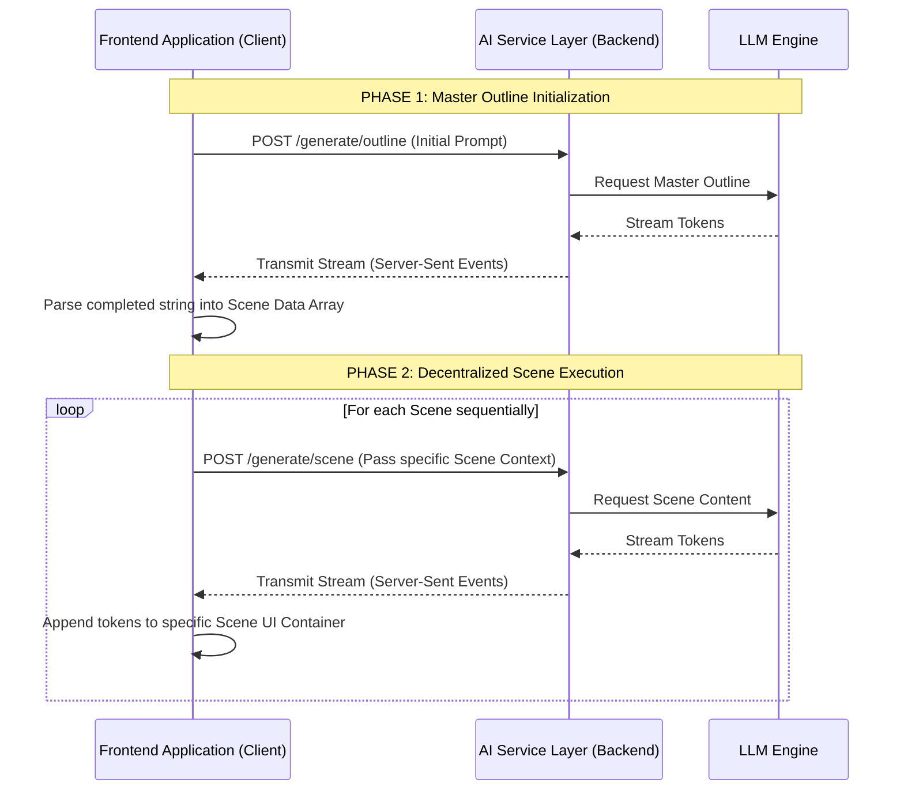

# Hierarchical + Sequential Script Generation (Blueprint Method)

## Overview
The "Blueprint" method optimizes script generation for application speed and structural integrity. It fundamentally divides the generation process into two decoupled, distinct phases:
1. **Master Outline Generation:** Generating and streaming a strict, full-length structural blueprint.
2. **Sequential Scene Execution:** The client iteratively orchestrates requests for individual scenes, mapping the streamed payloads into isolated UI domains.

This document details the theory behind the approach, as well as the architectural coordination required between the AI/Backend team and the Frontend Client (regardless of framework).

---

## 🧠 The Generation Approach (How it Works)
Before discussing technical implementation, it is vital to understand the theory behind the "Hierarchical + Sequential" workflow. This approach mimics a traditional screenwriter's methodology to solve common AI wandering issues.

### 1. Hierarchical Phase (The Master Outline)
- **Goal:** Establish a rigid, full-length structural skeleton.
- **Process:** The LLM is prompted with the core story concept and instructed to generate a high-level, page-by-page outline broken down into distinct, sequentially numbered scenes with brief summaries.
- **Why it matters:** By locking the structure globally before any dialogue or micro-action is written, we prevent the AI from "wandering" off-plot or losing the narrative thread—a frequent failure when LLMs attempt to generate long-form continuous content all at once.

### 2. Sequential Phase (Scene Execution)
- **Goal:** Fill in the detailed action and dialogue.
- **Process:** Based strictly on the generated Master Outline from Phase 1, the system generates the actual script one chunk (scene) at a time. The LLM is given the brief summary for the target scene and asked to expand it into standard screenplay format.
- **Why it matters:** This isolation significantly reduces token processing overhead and speeds up generation. Because the scene boundaries are already pre-planned hierarchically, the system does not have to re-evaluate the entire plot while merely writing dialogue for a single room.

---

## 🏗️ Streaming Architecture

```mermaid
sequenceDiagram
    participant FE as Frontend Application (Client)
    participant API as AI Service Layer (Backend)
    participant LLM as LLM Engine

    %% Phase 1: Outline
    Note over FE,LLM: PHASE 1: Master Outline Initialization
    FE->>API: POST /generate/outline (Initial Prompt)
    API->>LLM: Request Master Outline
    LLM-->>API: Stream Tokens
    API-->>FE: Transmit Stream (Server-Sent Events)
    FE->>FE: Parse completed string into Scene Data Array
    
    %% Phase 2: Sequential Scenes
    Note over FE,LLM: PHASE 2: Decentralized Scene Execution
    loop For each Scene sequentially
        FE->>API: POST /generate/scene (Pass specific Scene Context)
        API->>LLM: Request Scene Content
        LLM-->>API: Stream Tokens
        API-->>FE: Transmit Stream (Server-Sent Events)
        FE->>FE: Append tokens to specific Scene UI Container
    end
```

---

## ⚙️ Technical Implementation & Coordination Points

### 1. The Protocol Standard
Both the AI Backend and the Frontend must agree to utilize **Server-Sent Events (SSE)** for streaming interactions rather than WebSockets or chunked REST calls. 
- **Backend Responsibility:** Maintain a unidirectional streaming connection open, yielding tokens immediately as they arrive from the LLM engine to minimize Time-To-First-Byte (TTFB).
- **Frontend Responsibility:** Listen to the persistent HTTP connection, decoding raw byte streams into UTF-8 strings, and flushing them to the UI state incrementally.

### 2. Phase 1: Outline Parsing Contract
For Phase 1 to effectively trigger Phase 2, the frontend must be capable of algorithmically slicing the streamed outline into an array of individual scene objects.
- **AI Prompt Engineering:** The AI Lead must enforce strict formatting constraints on the LLM's outline output (e.g., standardizing on Markdown lists like `1. INT. KITCHEN - DAY - Summary...`).
- **Frontend Parsing:** Upon the closure of the Outline stream connection, the frontend runs a parser (e.g., regex pattern matching) over the complete string. It maps this data into temporary state objects representing the "Queue". Only a uniformly formatted stream from the backend prevents parsing corruption at this stage.

### 3. Phase 2: Queue Orchestration and State Ownership
The Backend must remain entirely stateless. It does not track which scenes have been generated. The **Frontend** operates as the master orchestrator.
- **Sequential Awaiting:** The frontend must iterate over the parsed Scene Array and initialize one SSE connection for `Scene 1`. It strictly awaits the closure of the `Scene 1` stream before firing the `POST` request for `Scene 2`. 
- **Context Injection:** When requesting a specific scene, the frontend must inject the specific context from the parsed Phase 1 outline data back into the API request payload so the stateless backend understands what to write.
- **Container Targetting:** Because the frontend manages the loop, it knows exactly which Scene is currently loading and effortlessly pipes the incoming payload to the correct modular UI container (e.g., an individual text editor component bound to Scene ID 4).

### 4. Error Handling and Resiliency
Because the frontend holds the state mechanism, error recovery becomes vastly simplified.
- **Connection Drops:** If a user's network drops during Phase 2 (e.g., while streaming Scene 5), the frontend simply registers the failure, retains Scenes 1-4 in local memory, and initiates an automatic or manual retry request exclusively targeting Scene 5.
- **Rate Limiting:** If the backend LLM engine hits an API quota limit during the iteration loop, the backend returns a standard 429 HTTP status. The frontend intercepts this, pauses the execution queue, and implements an exponential backoff strategy before resuming the remainder of the scenes.
