# 🏥 Aadhya AI — Complete System Architecture
### *Built for AestheticQ · March 2026*

---

> **What you're reading:** A complete, visual guide to every intelligent capability built inside Aadhya AI — from how a patient types a question to how the AI finds the right answer, remembers conversations, and keeps data private. Every diagram is designed to be easy to understand without a technical background.

---

## 📌 Table of Contents

1. [System Architecture Overview — Cloud Infrastructure & Deployment](#1-system-architecture-overview--cloud-infrastructure--deployment)
2. [How Agents Talk to Each Other — Agentic Workflow](#2-how-agents-talk-to-each-other--agentic-workflow)
3. [How Memory Works — Mem0](#3-how-memory-works--mem0)
4. [Feature: General Chat (Ask Anything)](#4-feature-general-chat--ask-anything)
5. [Feature: File Upload & Document Processing](#5-feature-file-upload--document-processing)
6. [Feature: Pre-Consultation Chat](#6-feature-pre-consultation-chat)
7. [Feature: Follow-Up Care Chat](#7-feature-follow-up-care-chat)
8. [Feature: Treatment Planner (Doctor Tool)](#8-feature-treatment-planner--doctor-tool)
9. [Feature: Product & Prescription Validation](#9-feature-product--prescription-validation)
10. [Feature: Personalised Recommendations](#10-feature-personalised-recommendations)
11. [Feature: Doctor–Patient Overview](#11-feature-doctorpatient-overview)
12. [Feature: Safety, Privacy & Security](#12-feature-safety-privacy--security)
13. [What Has Been Built — Feature Completion](#13-what-has-been-built--feature-completion)

---

## 1. System Architecture Overview — Cloud Infrastructure & Deployment

Aadhya AI is a cloud-native, multi-agent healthcare intelligence platform. When a patient or doctor submits a query through the application, a layered system of AI agents, data services, and memory infrastructure processes it in real time — delivering accurate, personalised, and privacy-compliant responses within seconds.

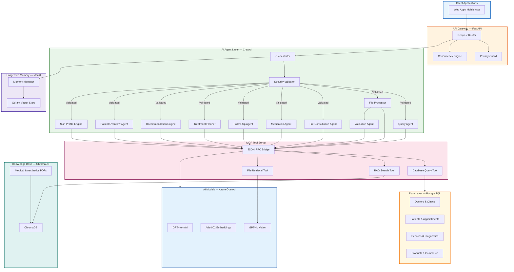
```mermaid
graph TB
    subgraph CLIENT["Client Applications"]
        APP["Web App / Mobile App"]
    end

    subgraph API["API Gateway — FastAPI"]
        FAST["Request Router"]
        MASK["Privacy Guard"]
        POOL["Concurrency Engine"]
    end

    subgraph AGENTS["AI Agent Layer — CrewAI"]
        ORCH["Orchestrator"]
        SECURITY["Security Validator"]
        QUERY["Query Agent"]
        FILE["File Processor"]
        BOOKING["Pre-Consultation Agent"]
        MED["Medication Agent"]
        FOLLOWUP["Follow-Up Agent"]
        TREATMENT["Treatment Planner"]
        RECOMMEND["Recommendation Engine"]
        PATIENT_OV["Patient Overview Agent"]
        VALID["Validation Agent"]
        SKIN["Skin Profile Engine"]
    end

    subgraph MCP["MCP Tool Server"]
        MCP_SRV["JSON-RPC Bridge"]
        DB_TOOL["Database Query Tool"]
        RAG_TOOL["RAG Search Tool"]
        FILE_TOOL["File Retrieval Tool"]
    end

    subgraph MEMORY["Long-Term Memory — Mem0"]
        MEM0["Memory Manager"]
        QDRANT["Qdrant Vector Store"]
    end

    subgraph RAG_KB["Knowledge Base — ChromaDB"]
        CHROMA["ChromaDB"]
        PDFSTORE["Medical & Aesthetics PDFs"]
    end

    subgraph DB["Data Layer — PostgreSQL"]
        DOCTORS["Doctors & Clinics"]
        PATIENTS["Patients & Appointments"]
        SERVICES["Services & Diagnostics"]
        PRODUCTS["Products & Commerce"]
    end

    subgraph AZURE["AI Models — Azure OpenAI"]
        GPT["GPT-4o-mini"]
        EMBED["Ada-002 Embeddings"]
        VISION["GPT-4o Vision"]
    end

    APP --> FAST
    FAST --> MASK
    FAST --> POOL
    FAST --> ORCH
    ORCH --> SECURITY
    SECURITY -->|"Validated"| QUERY
    SECURITY -->|"Validated"| FILE
    SECURITY -->|"Validated"| BOOKING
    SECURITY -->|"Validated"| MED
    SECURITY -->|"Validated"| FOLLOWUP
    SECURITY -->|"Validated"| TREATMENT
    SECURITY -->|"Validated"| RECOMMEND
    SECURITY -->|"Validated"| PATIENT_OV
    SECURITY -->|"Validated"| SKIN

    QUERY --> MCP_SRV
    FILE --> MCP_SRV
    BOOKING --> MCP_SRV
    MED --> MCP_SRV
    FOLLOWUP --> MCP_SRV
    TREATMENT --> MCP_SRV
    RECOMMEND --> MCP_SRV
    PATIENT_OV --> MCP_SRV
    SKIN --> MCP_SRV
    FILE --> VALID
    VALID --> MCP_SRV

    MCP_SRV --> DB_TOOL
    MCP_SRV --> RAG_TOOL
    MCP_SRV --> FILE_TOOL

    DB_TOOL --> DB
    RAG_TOOL --> CHROMA
    FILE_TOOL --> VISION

    ORCH --> MEM0
    MEM0 --> QDRANT

    PDFSTORE --> CHROMA
    MCP_SRV --> AZURE

    style CLIENT fill:#e8f4fd,stroke:#1565C0,stroke-width:2px
    style API fill:#fff3e0,stroke:#E65100,stroke-width:2px
    style AGENTS fill:#e8f5e9,stroke:#2E7D32,stroke-width:2px
    style MCP fill:#fce4ec,stroke:#880E4F,stroke-width:2px
    style MEMORY fill:#ede7f6,stroke:#4527A0,stroke-width:2px
    style RAG_KB fill:#e0f2f1,stroke:#00695C,stroke-width:2px
    style DB fill:#fff8e1,stroke:#F57F17,stroke-width:2px
    style AZURE fill:#e3f2fd,stroke:#0D47A1,stroke-width:2px
```

### In Plain English

| Layer | What It Does |
|---|---|
| **Client App** | Where the patient or doctor types their question |
| **FastAPI Server** | The front door — receives requests, sends replies, and masks sensitive info |
| **Orchestrator Agent** | The traffic controller — reads the request and decides which specialist agent to call |
| **Security Agent** | The bouncer — every single message is checked before any AI agent sees it |
| **Specialist Agents** | 10 purpose-built AI agents, each expert in their own task |
| **MCP Tool Server** | The bridge that lets AI agents safely talk to the database |
| **PostgreSQL Database** | Where all real clinic data lives — doctors, patients, services, products |
| **Mem0 Memory** | Long-term memory — Aadhya remembers patients across sessions |
| **RAG Knowledge Base** | A scanned library of medical PDFs for answering clinical questions |
| **Azure OpenAI** | The AI brain — GPT-4o-mini for reasoning, Ada-002 for semantic search |

---

## 2. How Agents Talk to Each Other — Agentic Workflow

Every request flows through a specific sequence of agents. This ensures accuracy, safety, and the right answer every time.

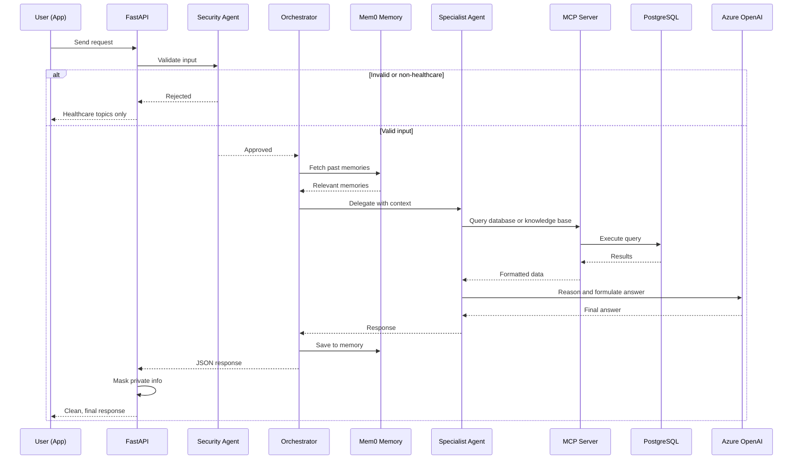
```mermaid
sequenceDiagram
    participant U as User (App)
    participant API as FastAPI
    participant SEC as Security Agent
    participant ORCH as Orchestrator
    participant MEM as Mem0 Memory
    participant SPEC as Specialist Agent
    participant MCP as MCP Server
    participant DB as PostgreSQL
    participant AI as Azure OpenAI

    U->>API: Send request
    API->>SEC: Validate input
    
    alt Invalid or non-healthcare
        SEC-->>API: Rejected
        API-->>U: Healthcare topics only
    else Valid input
        SEC-->>ORCH: Approved
        ORCH->>MEM: Fetch past memories
        MEM-->>ORCH: Relevant memories
        ORCH->>SPEC: Delegate with context
        SPEC->>MCP: Query database or knowledge base
        MCP->>DB: Execute query
        DB-->>MCP: Results
        MCP-->>SPEC: Formatted data
        SPEC->>AI: Reason and formulate answer
        AI-->>SPEC: Final answer
        SPEC-->>ORCH: Response
        ORCH->>MEM: Save to memory
        ORCH-->>API: JSON response
        API->>API: Mask private info
        API-->>U: Clean, final response
    end
```

### How the Orchestrator Decides Which Agent to Use

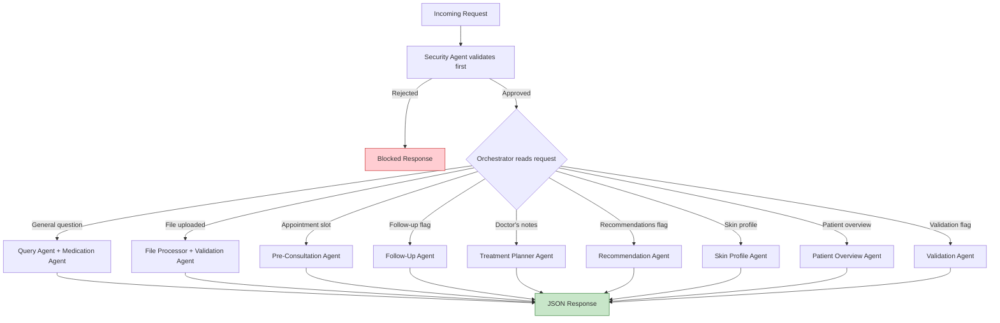
```mermaid
flowchart TD
    REQ["Incoming Request"] --> SEC["Security Agent validates first"]
    SEC -->|"Rejected"| BLOCK["Blocked Response"]
    SEC -->|"Approved"| ROUTE{"Orchestrator reads request"}

    ROUTE -->|"General question"| QA["Query Agent + Medication Agent"]
    ROUTE -->|"File uploaded"| FILE["File Processor + Validation Agent"]
    ROUTE -->|"Appointment slot"| BOOK["Pre-Consultation Agent"]
    ROUTE -->|"Follow-up flag"| FU["Follow-Up Agent"]
    ROUTE -->|"Doctor's notes"| TP["Treatment Planner Agent"]
    ROUTE -->|"Recommendations flag"| REC["Recommendation Agent"]
    ROUTE -->|"Skin profile"| SKIN["Skin Profile Agent"]
    ROUTE -->|"Patient overview"| POV["Patient Overview Agent"]
    ROUTE -->|"Validation flag"| VAL["Validation Agent"]

    QA --> OUT["JSON Response"]
    FILE --> OUT
    BOOK --> OUT
    FU --> OUT
    TP --> OUT
    REC --> OUT
    SKIN --> OUT
    POV --> OUT
    VAL --> OUT

    style BLOCK fill:#ffcdd2,stroke:#c62828
    style OUT fill:#c8e6c9,stroke:#2e7d32
```

---

## 3. How Memory Works — Mem0

Aadhya does not forget. When a patient chats today, Aadhya remembers it next week. This is powered by **Mem0** — a vector memory system backed by Qdrant.

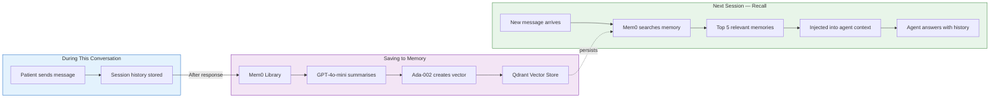
```mermaid
graph LR
    subgraph SESSION["During This Conversation"]
        CHAT["Patient sends message"]
        HIST["Session history stored"]
        CHAT --> HIST
    end

    subgraph SAVE["Saving to Memory"]
        HIST -->|"After response"| MEM0["Mem0 Library"]
        MEM0 --> GPT["GPT-4o-mini summarises"]
        GPT --> ADA["Ada-002 creates vector"]
        ADA --> QDRANT["Qdrant Vector Store"]
    end

    subgraph RECALL["Next Session — Recall"]
        NEW["New message arrives"]
        NEW --> SEARCH["Mem0 searches memory"]
        SEARCH --> RESULTS["Top 5 relevant memories"]
        RESULTS --> CONTEXT["Injected into agent context"]
        CONTEXT --> ANSWER["Agent answers with history"]
    end

    QDRANT -.->|"persists"| SEARCH

    style SESSION fill:#e3f2fd,stroke:#1565C0
    style SAVE fill:#f3e5f5,stroke:#7B1FA2
    style RECALL fill:#e8f5e9,stroke:#2e7d32
```

### Memory Scoping — No Cross-Contamination

Each memory is tagged with a unique `scope : user_id : session_id` so Patient A's memories never reach Patient B, and each session is completely isolated.

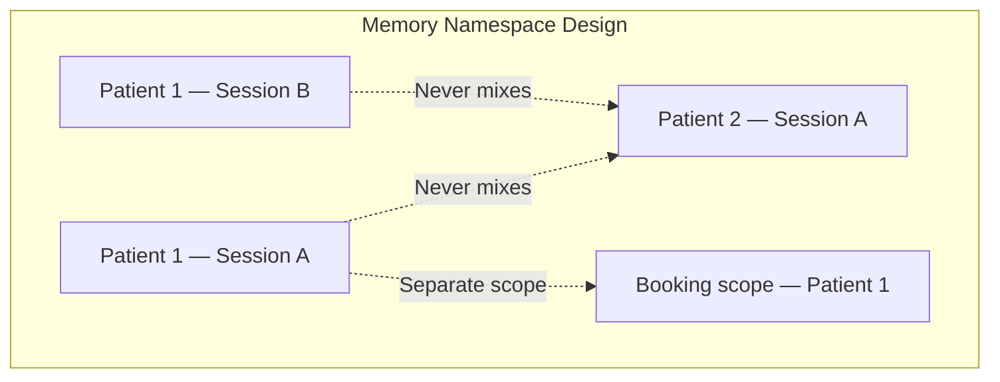
```mermaid
graph TD
    subgraph NAMESPACE["Memory Namespace Design"]
        M1["Patient 1 — Session A"]
        M2["Patient 1 — Session B"]
        M3["Patient 2 — Session A"]
        M4["Booking scope — Patient 1"]
    end

    M1 -.->|"Never mixes"| M3
    M2 -.->|"Never mixes"| M3
    M1 -.->|"Separate scope"| M4
```

---

## 4. Feature: General Chat — Ask Anything

A patient or doctor types a question in plain language. Aadhya searches the right sources in the right order and returns a factual, real-time answer.

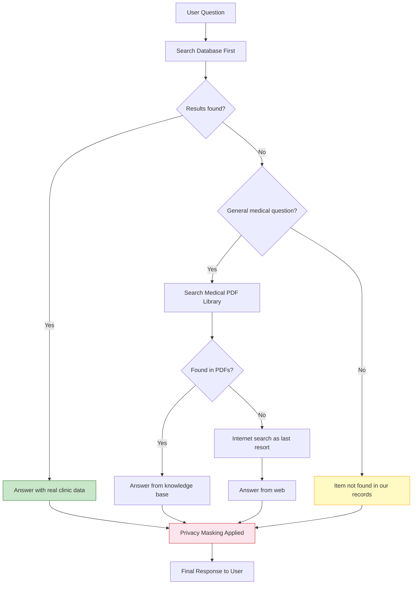
```mermaid
flowchart TD
    Q["User Question"] --> DB_FIRST["Search Database First"]
    DB_FIRST --> FOUND{"Results found?"}
    FOUND -->|"Yes"| ANSWER["Answer with real clinic data"]
    FOUND -->|"No"| GENERAL{"General medical question?"}
    GENERAL -->|"Yes"| RAG["Search Medical PDF Library"]
    GENERAL -->|"No"| NOT_FOUND["Item not found in our records"]
    RAG --> RAG_FOUND{"Found in PDFs?"}
    RAG_FOUND -->|"Yes"| RAG_ANS["Answer from knowledge base"]
    RAG_FOUND -->|"No"| INTERNET["Internet search as last resort"]
    INTERNET --> WEB_ANS["Answer from web"]

    ANSWER --> MASK["Privacy Masking Applied"]
    RAG_ANS --> MASK
    WEB_ANS --> MASK
    NOT_FOUND --> MASK
    MASK --> RESP["Final Response to User"]

    style ANSWER fill:#c8e6c9,stroke:#2e7d32
    style NOT_FOUND fill:#fff9c4,stroke:#f9a825
    style MASK fill:#fce4ec,stroke:#c62828
```

### Patient Mode vs Doctor Mode

| | **AADHYA (Patient Mode)** | **Doctor Mode** |
|---|---|---|
| **Persona** | Friendly, warm, encouraging | Professional, clinical, evidence-based |
| **Greeting** | "Hi, I'm AADHYA, your aesthetics assistant!" | Addresses doctor by name |
| **Language** | Simple, easy to understand | Medical terminology embraced |
| **Booking push** | Actively encourages booking | No booking push needed |

---

## 5. Feature: File Upload & Document Processing

Patients upload medical files (PDFs or images). Aadhya reads, classifies, verifies, and stores them with a full AI summary.

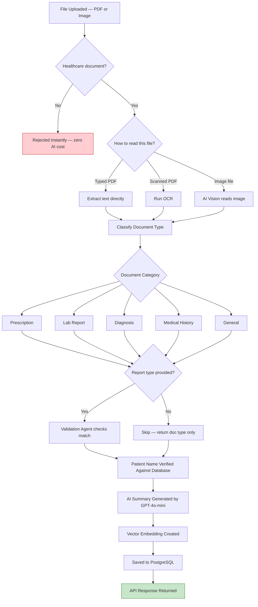
```mermaid
flowchart TD
    UPLOAD["File Uploaded — PDF or Image"] --> DETECT{"Healthcare document?"}
    DETECT -->|"No"| REJECT["Rejected instantly — zero AI cost"]
    DETECT -->|"Yes"| EXTRACT{"How to read this file?"}

    EXTRACT -->|"Typed PDF"| TEXT["Extract text directly"]
    EXTRACT -->|"Scanned PDF"| OCR["Run OCR"]
    EXTRACT -->|"Image file"| VISION["AI Vision reads image"]

    TEXT --> CLASSIFY["Classify Document Type"]
    OCR --> CLASSIFY
    VISION --> CLASSIFY

    CLASSIFY --> TYPES{"Document Category"}
    TYPES --> T1["Prescription"]
    TYPES --> T2["Lab Report"]
    TYPES --> T3["Diagnosis"]
    TYPES --> T4["Medical History"]
    TYPES --> T5["General"]

    T1 --> VERIFY
    T2 --> VERIFY
    T3 --> VERIFY
    T4 --> VERIFY
    T5 --> VERIFY

    VERIFY{"Report type provided?"}
    VERIFY -->|"Yes"| VALID_AGENT["Validation Agent checks match"]
    VERIFY -->|"No"| SKIP["Skip — return doc type only"]

    VALID_AGENT --> NAME_CHECK["Patient Name Verified Against Database"]
    SKIP --> NAME_CHECK

    NAME_CHECK --> SUMMARY["AI Summary Generated by GPT-4o-mini"]
    SUMMARY --> EMBED["Vector Embedding Created"]
    EMBED --> SAVE["Saved to PostgreSQL"]
    SAVE --> RESPONSE["API Response Returned"]

    style REJECT fill:#ffcdd2,stroke:#c62828
    style RESPONSE fill:#c8e6c9,stroke:#2e7d32
```

---

## 6. Feature: Pre-Consultation Chat

Before a patient's appointment, Aadhya acts like a smart nurse — gathering all the information the doctor needs through natural conversation.

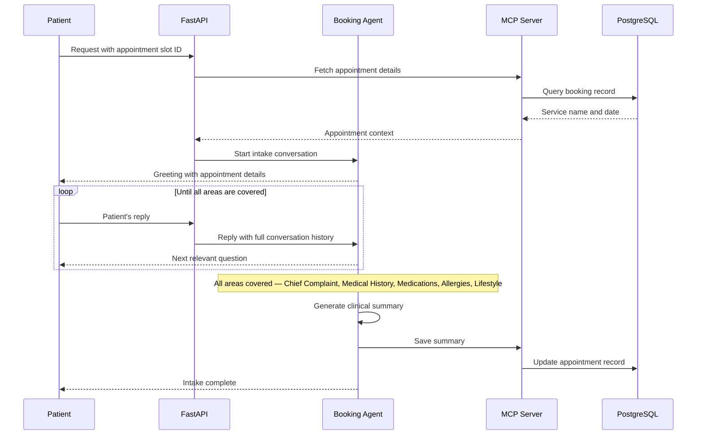
```mermaid
sequenceDiagram
    participant P as Patient
    participant API as FastAPI
    participant CREW as Booking Agent
    participant MCP as MCP Server
    participant DB as PostgreSQL

    P->>API: Request with appointment slot ID
    API->>MCP: Fetch appointment details
    MCP->>DB: Query booking record
    DB-->>MCP: Service name and date
    MCP-->>API: Appointment context
    API->>CREW: Start intake conversation

    CREW-->>P: Greeting with appointment details

    loop Until all areas are covered
        P->>API: Patient's reply
        API->>CREW: Reply with full conversation history
        CREW-->>P: Next relevant question
    end

    Note over CREW: All areas covered — Chief Complaint, Medical History, Medications, Allergies, Lifestyle

    CREW->>CREW: Generate clinical summary
    CREW->>MCP: Save summary
    MCP->>DB: Update appointment record
    CREW-->>P: Intake complete
```

---

## 7. Feature: Follow-Up Care Chat

After a patient completes treatment, Aadhya automatically checks in with treatment-specific questions.

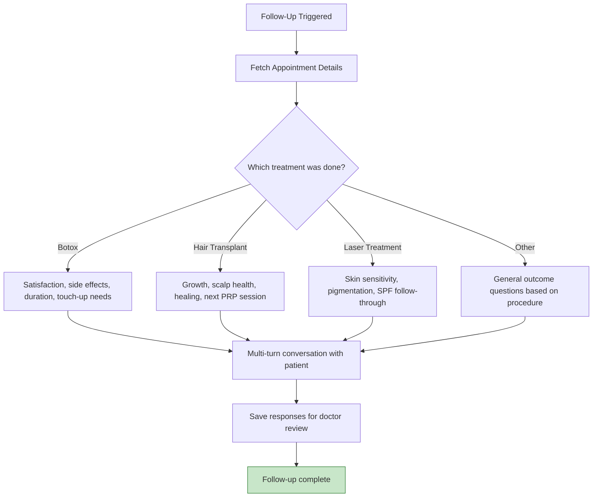
```mermaid
flowchart TD
    TRIGGER["Follow-Up Triggered"] --> FETCH["Fetch Appointment Details"]
    FETCH --> SERVICE{"Which treatment was done?"}

    SERVICE -->|"Botox"| BOT_Q["Satisfaction, side effects, duration, touch-up needs"]
    SERVICE -->|"Hair Transplant"| HAIR_Q["Growth, scalp health, healing, next PRP session"]
    SERVICE -->|"Laser Treatment"| LASER_Q["Skin sensitivity, pigmentation, SPF follow-through"]
    SERVICE -->|"Other"| GEN_Q["General outcome questions based on procedure"]

    BOT_Q --> CHAT["Multi-turn conversation with patient"]
    HAIR_Q --> CHAT
    LASER_Q --> CHAT
    GEN_Q --> CHAT

    CHAT --> SAVE["Save responses for doctor review"]
    SAVE --> DONE["Follow-up complete"]

    style DONE fill:#c8e6c9,stroke:#2e7d32
```

---

## 8. Feature: Treatment Planner — Doctor Tool

A doctor types free-form notes after a consultation. Aadhya converts them into a fully verified, structured treatment plan with real database IDs and pricing.

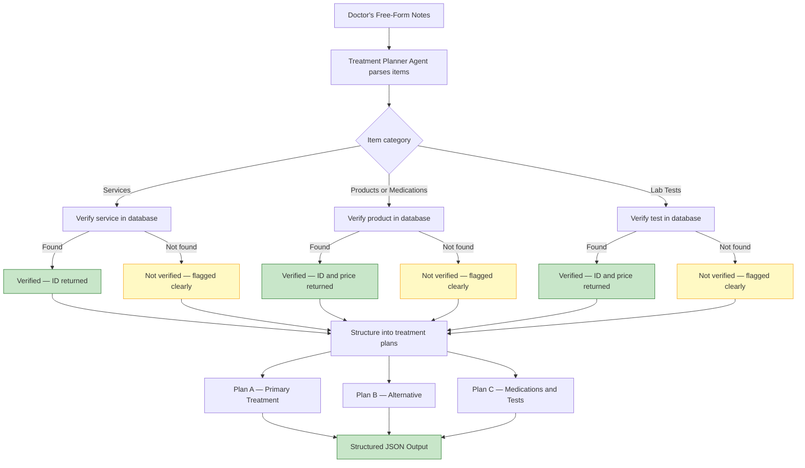
```mermaid
flowchart TD
    NOTES["Doctor's Free-Form Notes"] --> PARSE["Treatment Planner Agent parses items"]
    PARSE --> ITEMS{"Item category"}

    ITEMS -->|"Services"| SVC_VERIFY["Verify service in database"]
    ITEMS -->|"Products or Medications"| PROD_VERIFY["Verify product in database"]
    ITEMS -->|"Lab Tests"| LAB_VERIFY["Verify test in database"]

    SVC_VERIFY -->|"Found"| SVC_OK["Verified — ID returned"]
    SVC_VERIFY -->|"Not found"| SVC_MISS["Not verified — flagged clearly"]

    PROD_VERIFY -->|"Found"| PROD_OK["Verified — ID and price returned"]
    PROD_VERIFY -->|"Not found"| PROD_MISS["Not verified — flagged clearly"]

    LAB_VERIFY -->|"Found"| LAB_OK["Verified — ID and price returned"]
    LAB_VERIFY -->|"Not found"| LAB_MISS["Not verified — flagged clearly"]

    SVC_OK --> STRUCTURE["Structure into treatment plans"]
    SVC_MISS --> STRUCTURE
    PROD_OK --> STRUCTURE
    PROD_MISS --> STRUCTURE
    LAB_OK --> STRUCTURE
    LAB_MISS --> STRUCTURE

    STRUCTURE --> PLAN_A["Plan A — Primary Treatment"]
    STRUCTURE --> PLAN_B["Plan B — Alternative"]
    STRUCTURE --> PLAN_C["Plan C — Medications and Tests"]

    PLAN_A --> JSON_OUT["Structured JSON Output"]
    PLAN_B --> JSON_OUT
    PLAN_C --> JSON_OUT

    style SVC_OK fill:#c8e6c9,stroke:#2e7d32
    style PROD_OK fill:#c8e6c9,stroke:#2e7d32
    style LAB_OK fill:#c8e6c9,stroke:#2e7d32
    style SVC_MISS fill:#fff9c4,stroke:#f9a825
    style PROD_MISS fill:#fff9c4,stroke:#f9a825
    style LAB_MISS fill:#fff9c4,stroke:#f9a825
    style JSON_OUT fill:#c8e6c9,stroke:#2e7d32
```

---

## 9. Feature: Product & Prescription Validation

When a patient wants to buy a product, the system checks their uploaded prescription to verify they are authorised to take it.

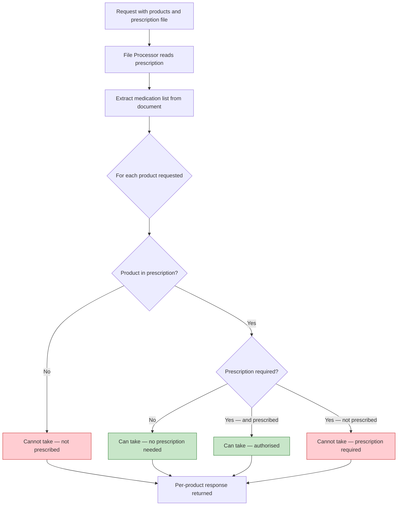
```mermaid
flowchart TD
    REQ["Request with products and prescription file"] --> FILE_READ["File Processor reads prescription"]
    FILE_READ --> EXTRACT["Extract medication list from document"]
    EXTRACT --> PER_PRODUCT{"For each product requested"}

    PER_PRODUCT --> CHECK{"Product in prescription?"}
    CHECK -->|"No"| NOT_PRESCRIBED["Cannot take — not prescribed"]
    CHECK -->|"Yes"| RX_CHECK{"Prescription required?"}

    RX_CHECK -->|"No"| CAN_TAKE_T["Can take — no prescription needed"]
    RX_CHECK -->|"Yes — and prescribed"| CAN_TAKE_T2["Can take — authorised"]
    RX_CHECK -->|"Yes — not prescribed"| CAN_TAKE_F2["Cannot take — prescription required"]

    CAN_TAKE_T --> RESP["Per-product response returned"]
    CAN_TAKE_T2 --> RESP
    NOT_PRESCRIBED --> RESP
    CAN_TAKE_F2 --> RESP

    style CAN_TAKE_T fill:#c8e6c9,stroke:#2e7d32
    style CAN_TAKE_T2 fill:#c8e6c9,stroke:#2e7d32
    style NOT_PRESCRIBED fill:#ffcdd2,stroke:#c62828
    style CAN_TAKE_F2 fill:#ffcdd2,stroke:#c62828
```

---

## 10. Feature: Personalised Recommendations

Aadhya proactively recommends services and products tailored to each patient's complete history.

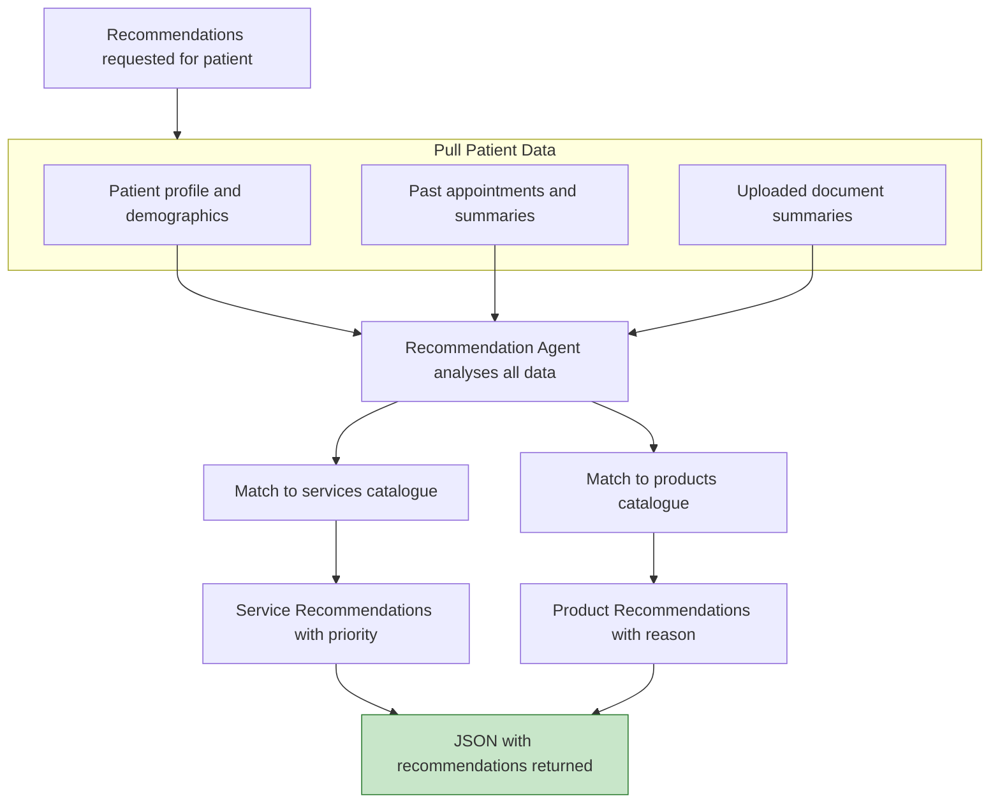
```mermaid
flowchart TD
    TRIGGER["Recommendations requested for patient"] --> DATA_PULL

    subgraph DATA_PULL["Pull Patient Data"]
        DEMO["Patient profile and demographics"]
        HISTORY["Past appointments and summaries"]
        FILES["Uploaded document summaries"]
    end

    DEMO --> ANALYSE["Recommendation Agent analyses all data"]
    HISTORY --> ANALYSE
    FILES --> ANALYSE

    ANALYSE --> SVC_MATCH["Match to services catalogue"]
    ANALYSE --> PROD_MATCH["Match to products catalogue"]

    SVC_MATCH --> SVC_RECS["Service Recommendations with priority"]
    PROD_MATCH --> PROD_RECS["Product Recommendations with reason"]

    SVC_RECS --> OUT["JSON with recommendations returned"]
    PROD_RECS --> OUT

    style OUT fill:#c8e6c9,stroke:#2e7d32
```

### 10a. Skin Profile Product Recommendations

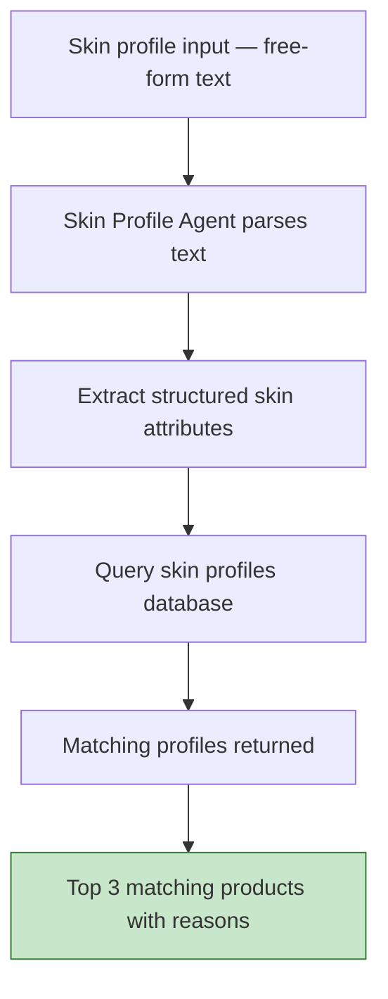
```mermaid
flowchart TD
    SKIN_IN["Skin profile input — free-form text"] --> PARSE_SKIN["Skin Profile Agent parses text"]
    PARSE_SKIN --> EXTRACT_FIELDS["Extract structured skin attributes"]
    EXTRACT_FIELDS --> DB_QUERY["Query skin profiles database"]
    DB_QUERY --> RESULTS["Matching profiles returned"]
    RESULTS --> TOP3["Top 3 matching products with reasons"]

    style TOP3 fill:#c8e6c9,stroke:#2e7d32
```

---

## 11. Feature: Doctor–Patient Overview

Doctors can ask natural questions about any specific patient and get clear, clinical-prose answers.

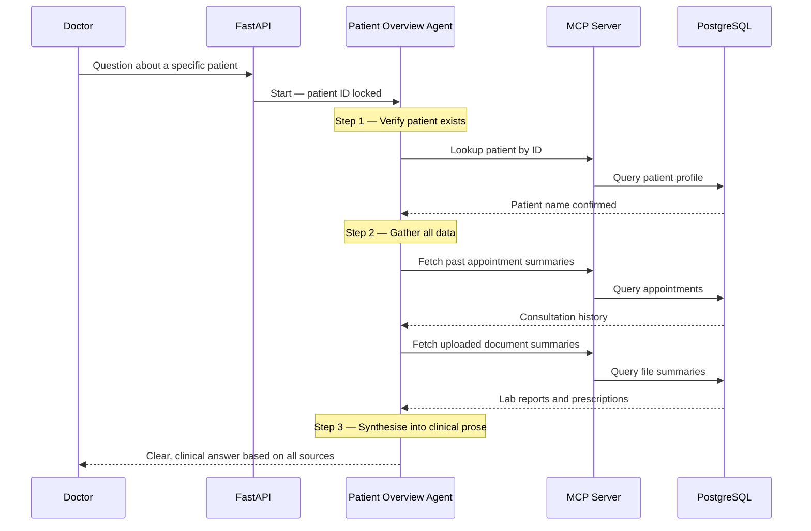
```mermaid
sequenceDiagram
    participant DOC as Doctor
    participant API as FastAPI
    participant POV as Patient Overview Agent
    participant MCP as MCP Server
    participant DB as PostgreSQL

    DOC->>API: Question about a specific patient
    API->>POV: Start — patient ID locked

    Note over POV: Step 1 — Verify patient exists
    POV->>MCP: Lookup patient by ID
    MCP->>DB: Query patient profile
    DB-->>POV: Patient name confirmed

    Note over POV: Step 2 — Gather all data
    POV->>MCP: Fetch past appointment summaries
    MCP->>DB: Query appointments
    DB-->>POV: Consultation history

    POV->>MCP: Fetch uploaded document summaries
    MCP->>DB: Query file summaries
    DB-->>POV: Lab reports and prescriptions

    Note over POV: Step 3 — Synthesise into clinical prose
    POV-->>DOC: Clear, clinical answer based on all sources
```

### Privacy Guard — Anti-Jailbreak

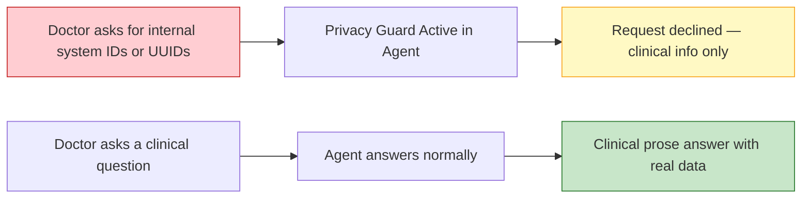
```mermaid
flowchart LR
    UNSAFE["Doctor asks for internal system IDs or UUIDs"]
    UNSAFE --> GUARD["Privacy Guard Active in Agent"]
    GUARD --> DECLINE["Request declined — clinical info only"]

    SAFE["Doctor asks a clinical question"]
    SAFE --> GUARD2["Agent answers normally"]
    GUARD2 --> CLINICAL["Clinical prose answer with real data"]

    style UNSAFE fill:#ffcdd2,stroke:#c62828
    style DECLINE fill:#fff9c4,stroke:#f9a825
    style CLINICAL fill:#c8e6c9,stroke:#2e7d32
```

---

## 12. Feature: Safety, Privacy & Security

Every part of Aadhya AI has been built with safety at its core — not bolted on, but woven in at every layer.

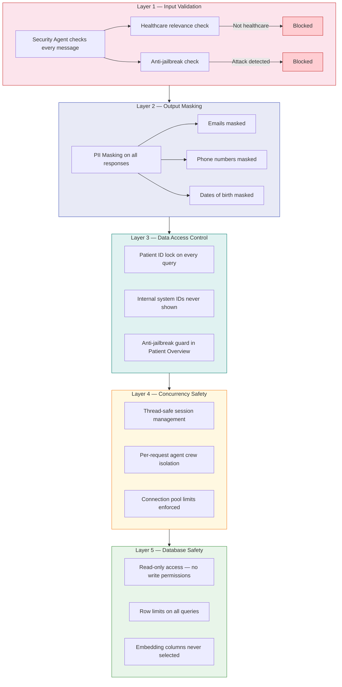
```mermaid
graph TD
    subgraph LAYER1["Layer 1 — Input Validation"]
        SEC_AGENT["Security Agent checks every message"]
        HEALTHCARE["Healthcare relevance check"]
        JAILBREAK["Anti-jailbreak check"]
        SEC_AGENT --> HEALTHCARE
        SEC_AGENT --> JAILBREAK
        HEALTHCARE -->|"Not healthcare"| BLOCK_IN["Blocked"]
        JAILBREAK -->|"Attack detected"| BLOCK_J["Blocked"]
    end

    subgraph LAYER2["Layer 2 — Output Masking"]
        PII["PII Masking on all responses"]
        EMAIL_MASK["Emails masked"]
        PHONE_MASK["Phone numbers masked"]
        DOB_MASK["Dates of birth masked"]
        PII --> EMAIL_MASK
        PII --> PHONE_MASK
        PII --> DOB_MASK
    end

    subgraph LAYER3["Layer 3 — Data Access Control"]
        PATIENT_LOCK["Patient ID lock on every query"]
        NO_UUID["Internal system IDs never shown"]
        PRIVACY_GUARD["Anti-jailbreak guard in Patient Overview"]
    end

    subgraph LAYER4["Layer 4 — Concurrency Safety"]
        THREAD_SAFE["Thread-safe session management"]
        PER_REQ["Per-request agent crew isolation"]
        POOL_INFO["Connection pool limits enforced"]
    end

    subgraph LAYER5["Layer 5 — Database Safety"]
        SQL_GUARD["Read-only access — no write permissions"]
        LIMIT_RULE["Row limits on all queries"]
        NO_EMBED["Embedding columns never selected"]
    end

    LAYER1 --> LAYER2
    LAYER2 --> LAYER3
    LAYER3 --> LAYER4
    LAYER4 --> LAYER5

    style BLOCK_IN fill:#ffcdd2,stroke:#c62828
    style BLOCK_J fill:#ffcdd2,stroke:#c62828
    style LAYER1 fill:#fce4ec,stroke:#c62828
    style LAYER2 fill:#e8eaf6,stroke:#3F51B5
    style LAYER3 fill:#e0f2f1,stroke:#00796B
    style LAYER4 fill:#fff8e1,stroke:#F57F17
    style LAYER5 fill:#e8f5e9,stroke:#388E3C
```

---

## 13. What Has Been Built — Feature Completion

Every feature listed below is **live, tested, and production-ready** as of March 2026.

| # | Feature | Status | What It Does |
|---|---|---|---|
| 1 | General Chat — Patient Mode | ✅ Live | AADHYA persona, DB search, RAG fallback, Mem0 memory |
| 2 | General Chat — Doctor Mode | ✅ Live | Professional persona, clinical depth, multi-source search |
| 3 | Healthcare Detection | ✅ Live | 120+ keyword filter — blocks non-medical uploads instantly at zero AI cost |
| 4 | Report Type Identification | ✅ Live | AI classifies into 5 document categories automatically |
| 5 | Report Type Verification | ✅ Live | Validates that the uploaded document matches the caller's expected report type |
| 6 | Patient Name Verification | ✅ Live | Prevents submitting someone else's reports using DB name match |
| 7 | PDF Text Extraction + Summary | ✅ Live | Full structured AI summary saved with vector embeddings to DB |
| 8 | Scanned PDF OCR + Summary | ✅ Live | OCR via pytesseract reads handwritten or scanned documents |
| 9 | Image Vision + Summary | ✅ Live | GPT-4o Vision reads image-only medical files |
| 10 | Pre-Consultation Chat | ✅ Live | Smart nurse intake — all key clinical areas covered naturally |
| 11 | Clinical Summary Generation | ✅ Live | Narrative prose summary saved to appointment record |
| 12 | Follow-Up Care Chat | ✅ Live | Treatment-specific post-care questions with multi-turn memory |
| 13 | Treatment Planner — Services | ✅ Live | Verifies services against DB, returns service_onboarding_id |
| 14 | Treatment Planner — Products | ✅ Live | Verifies products, returns product_id, MRP, and discount price |
| 15 | Treatment Planner — Lab Tests | ✅ Live | Verifies tests, returns diagnosis_id and price |
| 16 | Prescription Validation | ✅ Live | Per-product can_take: true or false based on uploaded prescription |
| 17 | Personalised Recommendations | ✅ Live | Services and products recommended based on full patient history |
| 18 | Skin Profile Recommendations | ✅ Live | Top 3 products matched to AI-derived skin scores |
| 19 | Patient Overview Chatbot | ✅ Live | Doctor asks questions in plain language, strictly locked to one patient |
| 20 | Long-Term Memory — Mem0 | ✅ Live | Per-user vector memory backed by Qdrant, survives session restarts |
| 21 | PII Masking and Privacy | ✅ Live | Auto-masks emails, phone numbers, and dates of birth in all responses |

---

> *Document prepared by the AI Engineering Team · AestheticQ · March 2026*
>
> *All 21 features are production-ready and tested. Architecture follows enterprise standards for concurrency, privacy, and clinical safety.*
